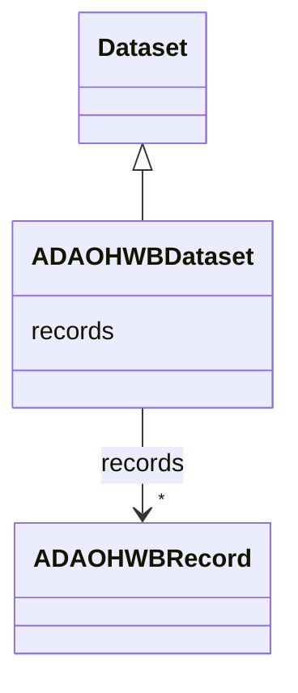

# Class: ADAOHWBDataset 


_The ADA OHWB dataset_


URI: [ada_ohwb:ADAOHWBDataset](https://w3id.org/OHD/DFA-study/ada_ohwb/ADAOHWBDataset)





## Inheritance
* [Dataset](Dataset.md)
    * **ADAOHWBDataset**


## Slots

| Name | Cardinality and Range | Description | Inheritance |
| ---  | --- | --- | --- |
| [records](records.md) | * <br/> [ADAOHWBRecord](ADAOHWBRecord.md) | Slot for connecting the dataset to its records | [Dataset](Dataset.md) |


## Identifier and Mapping Information


### Schema Source


* from schema: https://w3id.org/OHD/DFA-study/ada_ohwb


## Mappings

| Mapping Type | Mapped Value |
| ---  | ---  |
| self | ada_ohwb:ADAOHWBDataset |
| native | ada_ohwb:ADAOHWBDataset |


## LinkML Source

<!-- TODO: investigate https://stackoverflow.com/questions/37606292/how-to-create-tabbed-code-blocks-in-mkdocs-or-sphinx -->

### Direct

<details>
```yaml
name: ADA_OHWBDataset
description: The ADA OHWB dataset
from_schema: https://w3id.org/OHD/DFA-study/ada_ohwb
is_a: Dataset
slot_usage:
  records:
    name: records
    range: ADA_OHWBRecord

```
</details>

### Induced

<details>
```yaml
name: ADA_OHWBDataset
description: The ADA OHWB dataset
from_schema: https://w3id.org/OHD/DFA-study/ada_ohwb
is_a: Dataset
slot_usage:
  records:
    name: records
    range: ADA_OHWBRecord
attributes:
  records:
    name: records
    description: Slot for connecting the dataset to its records
    from_schema: https://w3id.org/OHD/DFA-study/ada_ohwb
    rank: 1000
    alias: records
    owner: ADA_OHWBDataset
    domain_of:
    - Dataset
    range: ADA_OHWBRecord
    multivalued: true
    inlined_as_list: true

```
</details>