# Class: ADAOHWBRecord 


_A record in the ADA OHWB dataset_


URI: [ada_ohwb:ADAOHWBRecord](https://w3id.org/OHD/DFA-study/ada_ohwb/ADAOHWBRecord)

```mermaid
 classDiagram
    class ADAOHWBRecord
    click ADAOHWBRecord href "../ADAOHWBRecord"
      Record <|-- ADAOHWBRecord
        click Record href "../Record"
      
      ADAOHWBRecord : MQ602
        
      ADAOHWBRecord : MQ603
        
          
    
        
        
        ADAOHWBRecord --> "0..1" IncomeLevel : MQ603
        click IncomeLevel href "../IncomeLevel"
    

        
      ADAOHWBRecord : MQ605
        
      ADAOHWBRecord : MQ607
        
          
    
        
        
        ADAOHWBRecord --> "0..1" ComputeIncomeLevel : MQ607
        click ComputeIncomeLevel href "../ComputeIncomeLevel"
    

        
      ADAOHWBRecord : Q268
        
          
    
        
        
        ADAOHWBRecord --> "0..1" MaleFemale : Q268
        click MaleFemale href "../MaleFemale"
    

        
      ADAOHWBRecord : Q280
        
      ADAOHWBRecord : Q318
        
          
    
        
        
        ADAOHWBRecord --> "0..1" State : Q318
        click State href "../State"
    

        
      ADAOHWBRecord : Q350
        
      ADAOHWBRecord : Q364
        
          
    
        
        
        ADAOHWBRecord --> "0..1" MaritalStatus : Q364
        click MaritalStatus href "../MaritalStatus"
    

        
      ADAOHWBRecord : Q368
        
      ADAOHWBRecord : Q372
        
      ADAOHWBRecord : Q410
        
          
    
        
        
        ADAOHWBRecord --> "0..1" EmploymentStatus : Q410
        click EmploymentStatus href "../EmploymentStatus"
    

        
      ADAOHWBRecord : Q437
        
          
    
        
        
        ADAOHWBRecord --> "0..1" Education : Q437
        click Education href "../Education"
    

        
      ADAOHWBRecord : Q462
        
          
    
        
        
        ADAOHWBRecord --> "0..1" IncomeCategory : Q462
        click IncomeCategory href "../IncomeCategory"
    

        
      ADAOHWBRecord : Q485
        
          
    
        
        
        ADAOHWBRecord --> "0..1" RaceEthnicity : Q485
        click RaceEthnicity href "../RaceEthnicity"
    

        
      ADAOHWBRecord : Q600
        
          
    
        
        
        ADAOHWBRecord --> "0..1" YesNoDK : Q600
        click YesNoDK href "../YesNoDK"
    

        
      ADAOHWBRecord : Q710
        
          
    
        
        
        ADAOHWBRecord --> "0..1" YesNoDK : Q710
        click YesNoDK href "../YesNoDK"
    

        
      ADAOHWBRecord : Q715_4
        
          
    
        
        
        ADAOHWBRecord --> "0..1" Frequency : Q715_4
        click Frequency href "../Frequency"
    

        
      ADAOHWBRecord : Q715_5
        
          
    
        
        
        ADAOHWBRecord --> "0..1" Frequency : Q715_5
        click Frequency href "../Frequency"
    

        
      ADAOHWBRecord : Q715_6
        
          
    
        
        
        ADAOHWBRecord --> "0..1" Frequency : Q715_6
        click Frequency href "../Frequency"
    

        
      ADAOHWBRecord : Q715_9
        
          
    
        
        
        ADAOHWBRecord --> "0..1" Frequency : Q715_9
        click Frequency href "../Frequency"
    

        
      ADAOHWBRecord : Q725_4
        
          
    
        
        
        ADAOHWBRecord --> "0..1" Agreement : Q725_4
        click Agreement href "../Agreement"
    

        
      ADAOHWBRecord : Q725_5
        
          
    
        
        
        ADAOHWBRecord --> "0..1" Agreement : Q725_5
        click Agreement href "../Agreement"
    

        
      ADAOHWBRecord : Q730
        
          
    
        
        
        ADAOHWBRecord --> "0..1" YesNoDK : Q730
        click YesNoDK href "../YesNoDK"
    

        
      ADAOHWBRecord : Q735
        
          
    
        
        
        ADAOHWBRecord --> "0..1" YesNoDK : Q735
        click YesNoDK href "../YesNoDK"
    

        
      ADAOHWBRecord : Q740_1
        
          
    
        
        
        ADAOHWBRecord --> "0..1" NoYes : Q740_1
        click NoYes href "../NoYes"
    

        
      ADAOHWBRecord : Q740_2
        
          
    
        
        
        ADAOHWBRecord --> "0..1" NoYes : Q740_2
        click NoYes href "../NoYes"
    

        
      ADAOHWBRecord : Q740_3
        
          
    
        
        
        ADAOHWBRecord --> "0..1" NoYes : Q740_3
        click NoYes href "../NoYes"
    

        
      ADAOHWBRecord : Q740_4
        
          
    
        
        
        ADAOHWBRecord --> "0..1" NoYes : Q740_4
        click NoYes href "../NoYes"
    

        
      ADAOHWBRecord : Q740_5
        
          
    
        
        
        ADAOHWBRecord --> "0..1" NoYes : Q740_5
        click NoYes href "../NoYes"
    

        
      ADAOHWBRecord : Q740_6
        
          
    
        
        
        ADAOHWBRecord --> "0..1" NoYes : Q740_6
        click NoYes href "../NoYes"
    

        
      ADAOHWBRecord : Q740_96
        
          
    
        
        
        ADAOHWBRecord --> "0..1" NoYes : Q740_96
        click NoYes href "../NoYes"
    

        
      ADAOHWBRecord : Q740_98
        
          
    
        
        
        ADAOHWBRecord --> "0..1" NoYes : Q740_98
        click NoYes href "../NoYes"
    

        
      ADAOHWBRecord : Q740_99
        
          
    
        
        
        ADAOHWBRecord --> "0..1" NoYes : Q740_99
        click NoYes href "../NoYes"
    

        
      ADAOHWBRecord : Q745_1
        
          
    
        
        
        ADAOHWBRecord --> "0..1" NoYes : Q745_1
        click NoYes href "../NoYes"
    

        
      ADAOHWBRecord : Q745_2
        
          
    
        
        
        ADAOHWBRecord --> "0..1" NoYes : Q745_2
        click NoYes href "../NoYes"
    

        
      ADAOHWBRecord : Q745_3
        
          
    
        
        
        ADAOHWBRecord --> "0..1" NoYes : Q745_3
        click NoYes href "../NoYes"
    

        
      ADAOHWBRecord : Q745_4
        
          
    
        
        
        ADAOHWBRecord --> "0..1" NoYes : Q745_4
        click NoYes href "../NoYes"
    

        
      ADAOHWBRecord : Q745_5
        
          
    
        
        
        ADAOHWBRecord --> "0..1" NoYes : Q745_5
        click NoYes href "../NoYes"
    

        
      ADAOHWBRecord : Q745_6
        
          
    
        
        
        ADAOHWBRecord --> "0..1" NoYes : Q745_6
        click NoYes href "../NoYes"
    

        
      ADAOHWBRecord : Q745_96
        
          
    
        
        
        ADAOHWBRecord --> "0..1" NoYes : Q745_96
        click NoYes href "../NoYes"
    

        
      ADAOHWBRecord : Q745_98
        
          
    
        
        
        ADAOHWBRecord --> "0..1" NoYes : Q745_98
        click NoYes href "../NoYes"
    

        
      ADAOHWBRecord : Q745_99
        
          
    
        
        
        ADAOHWBRecord --> "0..1" NoYes : Q745_99
        click NoYes href "../NoYes"
    

        
      ADAOHWBRecord : Q750
        
          
    
        
        
        ADAOHWBRecord --> "0..1" Difficulty : Q750
        click Difficulty href "../Difficulty"
    

        
      ADAOHWBRecord : Q760
        
          
    
        
        
        ADAOHWBRecord --> "0..1" YesNo : Q760
        click YesNo href "../YesNo"
    

        
      ADAOHWBRecord : Q765
        
          
    
        
        
        ADAOHWBRecord --> "0..1" TimeSinceDentalVisit : Q765
        click TimeSinceDentalVisit href "../TimeSinceDentalVisit"
    

        
      ADAOHWBRecord : Q770
        
          
    
        
        
        ADAOHWBRecord --> "0..1" YesNoDK : Q770
        click YesNoDK href "../YesNoDK"
    

        
      ADAOHWBRecord : Q775_1
        
          
    
        
        
        ADAOHWBRecord --> "0..1" NoYes : Q775_1
        click NoYes href "../NoYes"
    

        
      ADAOHWBRecord : Q775_2
        
          
    
        
        
        ADAOHWBRecord --> "0..1" NoYes : Q775_2
        click NoYes href "../NoYes"
    

        
      ADAOHWBRecord : Q775_3
        
          
    
        
        
        ADAOHWBRecord --> "0..1" NoYes : Q775_3
        click NoYes href "../NoYes"
    

        
      ADAOHWBRecord : Q775_4
        
          
    
        
        
        ADAOHWBRecord --> "0..1" NoYes : Q775_4
        click NoYes href "../NoYes"
    

        
      ADAOHWBRecord : Q775_5
        
          
    
        
        
        ADAOHWBRecord --> "0..1" NoYes : Q775_5
        click NoYes href "../NoYes"
    

        
      ADAOHWBRecord : Q775_6
        
          
    
        
        
        ADAOHWBRecord --> "0..1" NoYes : Q775_6
        click NoYes href "../NoYes"
    

        
      ADAOHWBRecord : Q775_7
        
          
    
        
        
        ADAOHWBRecord --> "0..1" NoYes : Q775_7
        click NoYes href "../NoYes"
    

        
      ADAOHWBRecord : Q775_8
        
          
    
        
        
        ADAOHWBRecord --> "0..1" NoYes : Q775_8
        click NoYes href "../NoYes"
    

        
      ADAOHWBRecord : Q775_9
        
          
    
        
        
        ADAOHWBRecord --> "0..1" NoYes : Q775_9
        click NoYes href "../NoYes"
    

        
      ADAOHWBRecord : Q775_96
        
          
    
        
        
        ADAOHWBRecord --> "0..1" NoYes : Q775_96
        click NoYes href "../NoYes"
    

        
      ADAOHWBRecord : Q775_97
        
          
    
        
        
        ADAOHWBRecord --> "0..1" NoYes : Q775_97
        click NoYes href "../NoYes"
    

        
      ADAOHWBRecord : RESPID
        
      
```





## Inheritance
* [Record](Record.md)
    * **ADAOHWBRecord**


## Slots

| Name | Cardinality and Range | Description | Inheritance |
| ---  | --- | --- | --- |
| [RESPID](RESPID.md) | 0..1 <br/> [Integer](Integer.md) | The respondant's study ID | direct |
| [Q710](Q710.md) | 0..1 <br/> [YesNoDK](YesNoDK.md) | Have you ever felt that the appearance of your mouth and teeth affected your ... | direct |
| [Q715_4](Q715_4.md) | 0..1 <br/> [Frequency](Frequency.md) | Felt anxiety: How often have you experienced each of the following problems r... | direct |
| [Q715_5](Q715_5.md) | 0..1 <br/> [Frequency](Frequency.md) | Felt embarrassment: How often have you experienced each of the following prob... | direct |
| [Q715_6](Q715_6.md) | 0..1 <br/> [Frequency](Frequency.md) | Avoided smiling: How often have you experienced each of the following problem... | direct |
| [Q715_9](Q715_9.md) | 0..1 <br/> [Frequency](Frequency.md) | Reduced participation in social activities: How often have you experienced ea... | direct |
| [Q725_4](Q725_4.md) | 0..1 <br/> [Agreement](Agreement.md) | I need to see the dentist twice a year: How strongly do you agree or disagree... | direct |
| [Q725_5](Q725_5.md) | 0..1 <br/> [Agreement](Agreement.md) | It is easier to get ahead in life if I have straight bright teeth: How strong... | direct |
| [Q730](Q730.md) | 0..1 <br/> [YesNoDK](YesNoDK.md) | Do you currently have health insurance for 2015? | direct |
| [Q735](Q735.md) | 0..1 <br/> [YesNoDK](YesNoDK.md) | Do you currently have dental insurance for 2015? | direct |
| [Q740_1](Q740_1.md) | 0..1 <br/> [NoYes](NoYes.md) | Employer (mine or my spouse/partner's): How did you obtain your own individua... | direct |
| [Q740_2](Q740_2.md) | 0..1 <br/> [NoYes](NoYes.md) | Through the new health insurance marketplace: How did you obtain your own ind... | direct |
| [Q740_3](Q740_3.md) | 0..1 <br/> [NoYes](NoYes.md) | Directly from the insurance company, not through the marketplace: How did you... | direct |
| [Q740_4](Q740_4.md) | 0..1 <br/> [NoYes](NoYes.md) | Medicaid (including state versions such as Montana Medicaid or New York State... | direct |
| [Q740_5](Q740_5.md) | 0..1 <br/> [NoYes](NoYes.md) | Medicare: How did you obtain your own individual health insurance for 2015? | direct |
| [Q740_6](Q740_6.md) | 0..1 <br/> [NoYes](NoYes.md) | Through a government program other than Medicaid/Medicare: How did you obtain... | direct |
| [Q740_96](Q740_96.md) | 0..1 <br/> [NoYes](NoYes.md) | Other: How did you obtain your own individual health insurance for 2015? | direct |
| [Q740_98](Q740_98.md) | 0..1 <br/> [NoYes](NoYes.md) | Don't know: How did you obtain your own individual health insurance for 2015? | direct |
| [Q740_99](Q740_99.md) | 0..1 <br/> [NoYes](NoYes.md) | N/A- I do not have health insurance for 2015: How did you obtain your own ind... | direct |
| [Q745_1](Q745_1.md) | 0..1 <br/> [NoYes](NoYes.md) | Employer (mine or my spouse/partner's): How did you obtain your own individua... | direct |
| [Q745_2](Q745_2.md) | 0..1 <br/> [NoYes](NoYes.md) | Through the new health insurance marketplace: How did you obtain your own ind... | direct |
| [Q745_3](Q745_3.md) | 0..1 <br/> [NoYes](NoYes.md) | Directly from the insurance company, not through the marketplace: How did you... | direct |
| [Q745_4](Q745_4.md) | 0..1 <br/> [NoYes](NoYes.md) | Medicaid (including state versions such as Montana Medicaid or New York State... | direct |
| [Q745_5](Q745_5.md) | 0..1 <br/> [NoYes](NoYes.md) | Medicare: How did you obtain your own individual dental insurance for 2015? | direct |
| [Q745_6](Q745_6.md) | 0..1 <br/> [NoYes](NoYes.md) | Through a government program other than Medicaid/Medicare (e | direct |
| [Q745_96](Q745_96.md) | 0..1 <br/> [NoYes](NoYes.md) | Other: How did you obtain your own individual dental insurance for 2015? | direct |
| [Q745_98](Q745_98.md) | 0..1 <br/> [NoYes](NoYes.md) | Don't know: How did you obtain your own individual dental insurance for 2015? | direct |
| [Q745_99](Q745_99.md) | 0..1 <br/> [NoYes](NoYes.md) | N/A- I do not have health insurance for 2015: How did you obtain your own ind... | direct |
| [Q750](Q750.md) | 0..1 <br/> [Difficulty](Difficulty.md) | How easy or difficult is it for you to find a dentist that accepts your denta... | direct |
| [Q760](Q760.md) | 0..1 <br/> [YesNo](YesNo.md) | Do you have a single dentist or dental office that is your usual source of de... | direct |
| [Q765](Q765.md) | 0..1 <br/> [TimeSinceDentalVisit](TimeSinceDentalVisit.md) | How long since you last had a dental visit? | direct |
| [Q770](Q770.md) | 0..1 <br/> [YesNoDK](YesNoDK.md) | Do you plan to visit the dentist in the next 12 months? | direct |
| [Q775_1](Q775_1.md) | 0..1 <br/> [NoYes](NoYes.md) | My mouth is healthy so I do not need to visit the dentist: Why did you not vi... | direct |
| [Q775_2](Q775_2.md) | 0..1 <br/> [NoYes](NoYes.md) | I do not know where to go to receive dental services: Why did you not visit t... | direct |
| [Q775_3](Q775_3.md) | 0..1 <br/> [NoYes](NoYes.md) | I cannot afford to go to the dentist: Why did you not visit the dentist more ... | direct |
| [Q775_4](Q775_4.md) | 0..1 <br/> [NoYes](NoYes.md) | It is too hard to find a dentist that accepts my dental plan or Medicaid: Why... | direct |
| [Q775_5](Q775_5.md) | 0..1 <br/> [NoYes](NoYes.md) | I cannot find the time to get to a dentist (e | direct |
| [Q775_6](Q775_6.md) | 0..1 <br/> [NoYes](NoYes.md) | Many services are not covered by my dental plan or Medicaid, so I end up havi... | direct |
| [Q775_7](Q775_7.md) | 0..1 <br/> [NoYes](NoYes.md) | I cannot travel to a dentist easily (e | direct |
| [Q775_8](Q775_8.md) | 0..1 <br/> [NoYes](NoYes.md) | I do not have any of my original teeth (i | direct |
| [Q775_9](Q775_9.md) | 0..1 <br/> [NoYes](NoYes.md) | I am afraid of going to the dentist: Why did you not visit the dentist more f... | direct |
| [Q775_96](Q775_96.md) | 0..1 <br/> [NoYes](NoYes.md) | Other: Why did you not visit the dentist more frequently? | direct |
| [Q775_97](Q775_97.md) | 0..1 <br/> [NoYes](NoYes.md) | No reason: Why did you not visit the dentist more frequently? | direct |
| [Q368](Q368.md) | 0..1 <br/> [Integer](Integer.md) | Including yourself, how many people age 18 or older live in your household? | direct |
| [Q372](Q372.md) | 0..1 <br/> [Integer](Integer.md) | How many people under the age of 18 live in your household? | direct |
| [MQ602](MQ602.md) | 0..1 <br/> [Integer](Integer.md) | Total number of people live in your household | direct |
| [MQ603](MQ603.md) | 0..1 <br/> [IncomeLevel](IncomeLevel.md) | Income Level | direct |
| [MQ605](MQ605.md) | 0..1 <br/> [Float](Float.md) | Compute Income Level1 | direct |
| [MQ607](MQ607.md) | 0..1 <br/> [ComputeIncomeLevel](ComputeIncomeLevel.md) | Compute Income Level2 | direct |
| [Q600](Q600.md) | 0..1 <br/> [YesNoDK](YesNoDK.md) | Are you currently receiving any Medicaid benefits? | direct |
| [Q268](Q268.md) | 0..1 <br/> [MaleFemale](MaleFemale.md) | Are you male/female? | direct |
| [Q280](Q280.md) | 0..1 <br/> [Integer](Integer.md) | Respondent Age (at time of data collection) | direct |
| [Q318](Q318.md) | 0..1 <br/> [State](State.md) | In what state or territory do you currently reside? | direct |
| [Q350](Q350.md) | 0..1 <br/> [Integer](Integer.md) | How many hours per week do you typically spend on the Internet or World Wide ... | direct |
| [Q410](Q410.md) | 0..1 <br/> [EmploymentStatus](EmploymentStatus.md) | Which one of the following best describes your employment status? | direct |
| [Q462](Q462.md) | 0..1 <br/> [IncomeCategory](IncomeCategory.md) | Which of the following income categories best describes your total 2014 house... | direct |
| [Q364](Q364.md) | 0..1 <br/> [MaritalStatus](MaritalStatus.md) | What is your marital status? | direct |
| [Q437](Q437.md) | 0..1 <br/> [Education](Education.md) | What is the highest level of education you have completed or the highest degr... | direct |
| [Q485](Q485.md) | 0..1 <br/> [RaceEthnicity](RaceEthnicity.md) | Race/Ethnicity | direct |


## Usages

| used by | used in | type | used |
| ---  | --- | --- | --- |
| [ADAOHWBDataset](ADAOHWBDataset.md) | [records](records.md) | range | [ADAOHWBRecord](ADAOHWBRecord.md) |


## Identifier and Mapping Information


### Schema Source


* from schema: https://w3id.org/OHD/DFA-study/ada_ohwb


## Mappings

| Mapping Type | Mapped Value |
| ---  | ---  |
| self | ada_ohwb:ADAOHWBRecord |
| native | ada_ohwb:ADAOHWBRecord |


## LinkML Source

<!-- TODO: investigate https://stackoverflow.com/questions/37606292/how-to-create-tabbed-code-blocks-in-mkdocs-or-sphinx -->

### Direct

<details>
```yaml
name: ADA_OHWBRecord
description: A record in the ADA OHWB dataset
from_schema: https://w3id.org/OHD/DFA-study/ada_ohwb
is_a: Record
slots:
- RESPID
- Q710
- Q715_4
- Q715_5
- Q715_6
- Q715_9
- Q725_4
- Q725_5
- Q730
- Q735
- Q740_1
- Q740_2
- Q740_3
- Q740_4
- Q740_5
- Q740_6
- Q740_96
- Q740_98
- Q740_99
- Q745_1
- Q745_2
- Q745_3
- Q745_4
- Q745_5
- Q745_6
- Q745_96
- Q745_98
- Q745_99
- Q750
- Q760
- Q765
- Q770
- Q775_1
- Q775_2
- Q775_3
- Q775_4
- Q775_5
- Q775_6
- Q775_7
- Q775_8
- Q775_9
- Q775_96
- Q775_97
- Q368
- Q372
- MQ602
- MQ603
- MQ605
- MQ607
- Q600
- Q268
- Q280
- Q318
- Q350
- Q410
- Q462
- Q364
- Q437
- Q485

```
</details>

### Induced

<details>
```yaml
name: ADA_OHWBRecord
description: A record in the ADA OHWB dataset
from_schema: https://w3id.org/OHD/DFA-study/ada_ohwb
is_a: Record
attributes:
  RESPID:
    name: RESPID
    description: The respondant's study ID.
    from_schema: https://w3id.org/OHD/DFA-study/ada_ohwb
    rank: 1000
    alias: RESPID
    owner: ADA_OHWBRecord
    domain_of:
    - ADA_OHWBRecord
    range: integer
  Q710:
    name: Q710
    description: Have you ever felt that the appearance of your mouth and teeth affected
      your ability to interview for a job?
    from_schema: https://w3id.org/OHD/DFA-study/ada_ohwb
    rank: 1000
    alias: Q710
    owner: ADA_OHWBRecord
    domain_of:
    - ADA_OHWBRecord
    range: YesNoDK
  Q715_4:
    name: Q715_4
    description: 'Felt anxiety: How often have you experienced each of the following
      problems related to your mouth and teeth during the past 12 months?'
    from_schema: https://w3id.org/OHD/DFA-study/ada_ohwb
    rank: 1000
    alias: Q715_4
    owner: ADA_OHWBRecord
    domain_of:
    - ADA_OHWBRecord
    range: Frequency
  Q715_5:
    name: Q715_5
    description: 'Felt embarrassment: How often have you experienced each of the following
      problems related to your mouth and teeth during the past 12 months?'
    from_schema: https://w3id.org/OHD/DFA-study/ada_ohwb
    rank: 1000
    alias: Q715_5
    owner: ADA_OHWBRecord
    domain_of:
    - ADA_OHWBRecord
    range: Frequency
  Q715_6:
    name: Q715_6
    description: 'Avoided smiling: How often have you experienced each of the following
      problems related to your mouth and teeth during the past 12 months?'
    from_schema: https://w3id.org/OHD/DFA-study/ada_ohwb
    rank: 1000
    alias: Q715_6
    owner: ADA_OHWBRecord
    domain_of:
    - ADA_OHWBRecord
    range: Frequency
  Q715_9:
    name: Q715_9
    description: 'Reduced participation in social activities: How often have you experienced
      each of the following problems related to your mouth and teeth during the past
      12 months?'
    from_schema: https://w3id.org/OHD/DFA-study/ada_ohwb
    rank: 1000
    alias: Q715_9
    owner: ADA_OHWBRecord
    domain_of:
    - ADA_OHWBRecord
    range: Frequency
  Q725_4:
    name: Q725_4
    description: 'I need to see the dentist twice a year: How strongly do you agree
      or disagree with the following statements about how you perceive the health
      of your mouth?'
    from_schema: https://w3id.org/OHD/DFA-study/ada_ohwb
    rank: 1000
    alias: Q725_4
    owner: ADA_OHWBRecord
    domain_of:
    - ADA_OHWBRecord
    range: Agreement
  Q725_5:
    name: Q725_5
    description: 'It is easier to get ahead in life if I have straight bright teeth:
      How strongly do you agree or disagree with the following statements about how
      you perceive the health of your mouth?'
    from_schema: https://w3id.org/OHD/DFA-study/ada_ohwb
    rank: 1000
    alias: Q725_5
    owner: ADA_OHWBRecord
    domain_of:
    - ADA_OHWBRecord
    range: Agreement
  Q730:
    name: Q730
    description: Do you currently have health insurance for 2015?
    from_schema: https://w3id.org/OHD/DFA-study/ada_ohwb
    rank: 1000
    alias: Q730
    owner: ADA_OHWBRecord
    domain_of:
    - ADA_OHWBRecord
    range: YesNoDK
  Q735:
    name: Q735
    description: Do you currently have dental insurance for 2015?
    from_schema: https://w3id.org/OHD/DFA-study/ada_ohwb
    rank: 1000
    alias: Q735
    owner: ADA_OHWBRecord
    domain_of:
    - ADA_OHWBRecord
    range: YesNoDK
  Q740_1:
    name: Q740_1
    description: 'Employer (mine or my spouse/partner''s): How did you obtain your
      own individual health insurance for 2015?'
    from_schema: https://w3id.org/OHD/DFA-study/ada_ohwb
    rank: 1000
    alias: Q740_1
    owner: ADA_OHWBRecord
    domain_of:
    - ADA_OHWBRecord
    range: NoYes
  Q740_2:
    name: Q740_2
    description: 'Through the new health insurance marketplace: How did you obtain
      your own individual health insurance for 2015?'
    from_schema: https://w3id.org/OHD/DFA-study/ada_ohwb
    rank: 1000
    alias: Q740_2
    owner: ADA_OHWBRecord
    domain_of:
    - ADA_OHWBRecord
    range: NoYes
  Q740_3:
    name: Q740_3
    description: 'Directly from the insurance company, not through the marketplace:
      How did you obtain your own individual health insurance for 2015?'
    from_schema: https://w3id.org/OHD/DFA-study/ada_ohwb
    rank: 1000
    alias: Q740_3
    owner: ADA_OHWBRecord
    domain_of:
    - ADA_OHWBRecord
    range: NoYes
  Q740_4:
    name: Q740_4
    description: 'Medicaid (including state versions such as Montana Medicaid or New
      York State of Health Medicaid): How did you obtain your own individual health
      insurance for 2015?'
    from_schema: https://w3id.org/OHD/DFA-study/ada_ohwb
    rank: 1000
    alias: Q740_4
    owner: ADA_OHWBRecord
    domain_of:
    - ADA_OHWBRecord
    range: NoYes
  Q740_5:
    name: Q740_5
    description: 'Medicare: How did you obtain your own individual health insurance
      for 2015?'
    from_schema: https://w3id.org/OHD/DFA-study/ada_ohwb
    rank: 1000
    alias: Q740_5
    owner: ADA_OHWBRecord
    domain_of:
    - ADA_OHWBRecord
    range: NoYes
  Q740_6:
    name: Q740_6
    description: 'Through a government program other than Medicaid/Medicare: How did
      you obtain your own individual health insurance for 2015?'
    from_schema: https://w3id.org/OHD/DFA-study/ada_ohwb
    rank: 1000
    alias: Q740_6
    owner: ADA_OHWBRecord
    domain_of:
    - ADA_OHWBRecord
    range: NoYes
  Q740_96:
    name: Q740_96
    description: 'Other: How did you obtain your own individual health insurance for
      2015?'
    from_schema: https://w3id.org/OHD/DFA-study/ada_ohwb
    rank: 1000
    alias: Q740_96
    owner: ADA_OHWBRecord
    domain_of:
    - ADA_OHWBRecord
    range: NoYes
  Q740_98:
    name: Q740_98
    description: 'Don''t know: How did you obtain your own individual health insurance
      for 2015?'
    from_schema: https://w3id.org/OHD/DFA-study/ada_ohwb
    rank: 1000
    alias: Q740_98
    owner: ADA_OHWBRecord
    domain_of:
    - ADA_OHWBRecord
    range: NoYes
  Q740_99:
    name: Q740_99
    description: 'N/A- I do not have health insurance for 2015: How did you obtain
      your own individual health insurance for 2015?'
    from_schema: https://w3id.org/OHD/DFA-study/ada_ohwb
    rank: 1000
    alias: Q740_99
    owner: ADA_OHWBRecord
    domain_of:
    - ADA_OHWBRecord
    range: NoYes
  Q745_1:
    name: Q745_1
    description: 'Employer (mine or my spouse/partner''s): How did you obtain your
      own individual dental insurance for 2015?'
    from_schema: https://w3id.org/OHD/DFA-study/ada_ohwb
    rank: 1000
    alias: Q745_1
    owner: ADA_OHWBRecord
    domain_of:
    - ADA_OHWBRecord
    range: NoYes
  Q745_2:
    name: Q745_2
    description: 'Through the new health insurance marketplace: How did you obtain
      your own individual dental insurance for 2015?'
    from_schema: https://w3id.org/OHD/DFA-study/ada_ohwb
    rank: 1000
    alias: Q745_2
    owner: ADA_OHWBRecord
    domain_of:
    - ADA_OHWBRecord
    range: NoYes
  Q745_3:
    name: Q745_3
    description: 'Directly from the insurance company, not through the marketplace:
      How did you obtain your own individual dental insurance for 2015?'
    from_schema: https://w3id.org/OHD/DFA-study/ada_ohwb
    rank: 1000
    alias: Q745_3
    owner: ADA_OHWBRecord
    domain_of:
    - ADA_OHWBRecord
    range: NoYes
  Q745_4:
    name: Q745_4
    description: 'Medicaid (including state versions such as Montana Medicaid or New
      York State of Health Medicaid): How did you obtain your own individual dental
      insurance for 2015?'
    from_schema: https://w3id.org/OHD/DFA-study/ada_ohwb
    rank: 1000
    alias: Q745_4
    owner: ADA_OHWBRecord
    domain_of:
    - ADA_OHWBRecord
    range: NoYes
  Q745_5:
    name: Q745_5
    description: 'Medicare: How did you obtain your own individual dental insurance
      for 2015?'
    from_schema: https://w3id.org/OHD/DFA-study/ada_ohwb
    rank: 1000
    alias: Q745_5
    owner: ADA_OHWBRecord
    domain_of:
    - ADA_OHWBRecord
    range: NoYes
  Q745_6:
    name: Q745_6
    description: 'Through a government program other than Medicaid/Medicare (e.g.,
      VA, TRICARE, SSI): How did you obtain your own individual dental insurance for
      2015?'
    from_schema: https://w3id.org/OHD/DFA-study/ada_ohwb
    rank: 1000
    alias: Q745_6
    owner: ADA_OHWBRecord
    domain_of:
    - ADA_OHWBRecord
    range: NoYes
  Q745_96:
    name: Q745_96
    description: 'Other: How did you obtain your own individual dental insurance for
      2015?'
    from_schema: https://w3id.org/OHD/DFA-study/ada_ohwb
    rank: 1000
    alias: Q745_96
    owner: ADA_OHWBRecord
    domain_of:
    - ADA_OHWBRecord
    range: NoYes
  Q745_98:
    name: Q745_98
    description: 'Don''t know: How did you obtain your own individual dental insurance
      for 2015?'
    from_schema: https://w3id.org/OHD/DFA-study/ada_ohwb
    rank: 1000
    alias: Q745_98
    owner: ADA_OHWBRecord
    domain_of:
    - ADA_OHWBRecord
    range: NoYes
  Q745_99:
    name: Q745_99
    description: 'N/A- I do not have health insurance for 2015: How did you obtain
      your own individual dental insurance for 2015?'
    from_schema: https://w3id.org/OHD/DFA-study/ada_ohwb
    rank: 1000
    alias: Q745_99
    owner: ADA_OHWBRecord
    domain_of:
    - ADA_OHWBRecord
    range: NoYes
  Q750:
    name: Q750
    description: How easy or difficult is it for you to find a dentist that accepts
      your dental insurance?
    from_schema: https://w3id.org/OHD/DFA-study/ada_ohwb
    rank: 1000
    alias: Q750
    owner: ADA_OHWBRecord
    domain_of:
    - ADA_OHWBRecord
    range: Difficulty
  Q760:
    name: Q760
    description: Do you have a single dentist or dental office that is your usual
      source of dental care?
    from_schema: https://w3id.org/OHD/DFA-study/ada_ohwb
    rank: 1000
    alias: Q760
    owner: ADA_OHWBRecord
    domain_of:
    - ADA_OHWBRecord
    range: YesNo
  Q765:
    name: Q765
    description: How long since you last had a dental visit?
    from_schema: https://w3id.org/OHD/DFA-study/ada_ohwb
    rank: 1000
    alias: Q765
    owner: ADA_OHWBRecord
    domain_of:
    - ADA_OHWBRecord
    range: TimeSinceDentalVisit
  Q770:
    name: Q770
    description: Do you plan to visit the dentist in the next 12 months?
    from_schema: https://w3id.org/OHD/DFA-study/ada_ohwb
    rank: 1000
    alias: Q770
    owner: ADA_OHWBRecord
    domain_of:
    - ADA_OHWBRecord
    range: YesNoDK
  Q775_1:
    name: Q775_1
    description: 'My mouth is healthy so I do not need to visit the dentist: Why did
      you not visit the dentist more frequently?'
    from_schema: https://w3id.org/OHD/DFA-study/ada_ohwb
    rank: 1000
    alias: Q775_1
    owner: ADA_OHWBRecord
    domain_of:
    - ADA_OHWBRecord
    range: NoYes
  Q775_2:
    name: Q775_2
    description: 'I do not know where to go to receive dental services: Why did you
      not visit the dentist more frequently?'
    from_schema: https://w3id.org/OHD/DFA-study/ada_ohwb
    rank: 1000
    alias: Q775_2
    owner: ADA_OHWBRecord
    domain_of:
    - ADA_OHWBRecord
    range: NoYes
  Q775_3:
    name: Q775_3
    description: 'I cannot afford to go to the dentist: Why did you not visit the
      dentist more frequently?'
    from_schema: https://w3id.org/OHD/DFA-study/ada_ohwb
    rank: 1000
    alias: Q775_3
    owner: ADA_OHWBRecord
    domain_of:
    - ADA_OHWBRecord
    range: NoYes
  Q775_4:
    name: Q775_4
    description: 'It is too hard to find a dentist that accepts my dental plan or
      Medicaid: Why did you not visit the dentist more frequently?'
    from_schema: https://w3id.org/OHD/DFA-study/ada_ohwb
    rank: 1000
    alias: Q775_4
    owner: ADA_OHWBRecord
    domain_of:
    - ADA_OHWBRecord
    range: NoYes
  Q775_5:
    name: Q775_5
    description: 'I cannot find the time to get to a dentist (e.g., cannot get the
      time off from work, dentist does not have convenient office hours): Why did
      you not visit the dentist more frequently?'
    from_schema: https://w3id.org/OHD/DFA-study/ada_ohwb
    rank: 1000
    alias: Q775_5
    owner: ADA_OHWBRecord
    domain_of:
    - ADA_OHWBRecord
    range: NoYes
  Q775_6:
    name: Q775_6
    description: 'Many services are not covered by my dental plan or Medicaid, so
      I end up having to pay with my own money: Why did you not visit the dentist
      more frequently?'
    from_schema: https://w3id.org/OHD/DFA-study/ada_ohwb
    rank: 1000
    alias: Q775_6
    owner: ADA_OHWBRecord
    domain_of:
    - ADA_OHWBRecord
    range: NoYes
  Q775_7:
    name: Q775_7
    description: 'I cannot travel to a dentist easily (e.g., do not have transportation,
      located too far away): Why did you not visit the dentist more frequently?'
    from_schema: https://w3id.org/OHD/DFA-study/ada_ohwb
    rank: 1000
    alias: Q775_7
    owner: ADA_OHWBRecord
    domain_of:
    - ADA_OHWBRecord
    range: NoYes
  Q775_8:
    name: Q775_8
    description: 'I do not have any of my original teeth (i.e. I have no teeth, or
      I have dentures): Why did you not visit the dentist more frequently?'
    from_schema: https://w3id.org/OHD/DFA-study/ada_ohwb
    rank: 1000
    alias: Q775_8
    owner: ADA_OHWBRecord
    domain_of:
    - ADA_OHWBRecord
    range: NoYes
  Q775_9:
    name: Q775_9
    description: 'I am afraid of going to the dentist: Why did you not visit the dentist
      more frequently?'
    from_schema: https://w3id.org/OHD/DFA-study/ada_ohwb
    rank: 1000
    alias: Q775_9
    owner: ADA_OHWBRecord
    domain_of:
    - ADA_OHWBRecord
    range: NoYes
  Q775_96:
    name: Q775_96
    description: 'Other: Why did you not visit the dentist more frequently?'
    from_schema: https://w3id.org/OHD/DFA-study/ada_ohwb
    rank: 1000
    alias: Q775_96
    owner: ADA_OHWBRecord
    domain_of:
    - ADA_OHWBRecord
    range: NoYes
  Q775_97:
    name: Q775_97
    description: 'No reason: Why did you not visit the dentist more frequently?'
    from_schema: https://w3id.org/OHD/DFA-study/ada_ohwb
    rank: 1000
    alias: Q775_97
    owner: ADA_OHWBRecord
    domain_of:
    - ADA_OHWBRecord
    range: NoYes
  Q368:
    name: Q368
    description: Including yourself, how many people age 18 or older live in your
      household?
    from_schema: https://w3id.org/OHD/DFA-study/ada_ohwb
    rank: 1000
    alias: Q368
    owner: ADA_OHWBRecord
    domain_of:
    - ADA_OHWBRecord
    range: integer
  Q372:
    name: Q372
    description: How many people under the age of 18 live in your household?
    from_schema: https://w3id.org/OHD/DFA-study/ada_ohwb
    rank: 1000
    alias: Q372
    owner: ADA_OHWBRecord
    domain_of:
    - ADA_OHWBRecord
    range: integer
  MQ602:
    name: MQ602
    description: Total number of people live in your household.
    from_schema: https://w3id.org/OHD/DFA-study/ada_ohwb
    rank: 1000
    alias: MQ602
    owner: ADA_OHWBRecord
    domain_of:
    - ADA_OHWBRecord
    range: integer
  MQ603:
    name: MQ603
    description: Income Level
    from_schema: https://w3id.org/OHD/DFA-study/ada_ohwb
    rank: 1000
    alias: MQ603
    owner: ADA_OHWBRecord
    domain_of:
    - ADA_OHWBRecord
    range: IncomeLevel
  MQ605:
    name: MQ605
    description: Compute Income Level1
    from_schema: https://w3id.org/OHD/DFA-study/ada_ohwb
    rank: 1000
    alias: MQ605
    owner: ADA_OHWBRecord
    domain_of:
    - ADA_OHWBRecord
    range: float
  MQ607:
    name: MQ607
    description: Compute Income Level2
    from_schema: https://w3id.org/OHD/DFA-study/ada_ohwb
    rank: 1000
    alias: MQ607
    owner: ADA_OHWBRecord
    domain_of:
    - ADA_OHWBRecord
    range: ComputeIncomeLevel
  Q600:
    name: Q600
    description: Are you currently receiving any Medicaid benefits?
    from_schema: https://w3id.org/OHD/DFA-study/ada_ohwb
    rank: 1000
    alias: Q600
    owner: ADA_OHWBRecord
    domain_of:
    - ADA_OHWBRecord
    range: YesNoDK
  Q268:
    name: Q268
    description: Are you male/female?
    from_schema: https://w3id.org/OHD/DFA-study/ada_ohwb
    rank: 1000
    alias: Q268
    owner: ADA_OHWBRecord
    domain_of:
    - ADA_OHWBRecord
    range: MaleFemale
  Q280:
    name: Q280
    description: Respondent Age (at time of data collection)
    from_schema: https://w3id.org/OHD/DFA-study/ada_ohwb
    rank: 1000
    alias: Q280
    owner: ADA_OHWBRecord
    domain_of:
    - ADA_OHWBRecord
    range: integer
  Q318:
    name: Q318
    description: In what state or territory do you currently reside?
    from_schema: https://w3id.org/OHD/DFA-study/ada_ohwb
    rank: 1000
    alias: Q318
    owner: ADA_OHWBRecord
    domain_of:
    - ADA_OHWBRecord
    range: State
  Q350:
    name: Q350
    description: How many hours per week do you typically spend on the Internet or
      World Wide Web?
    from_schema: https://w3id.org/OHD/DFA-study/ada_ohwb
    rank: 1000
    alias: Q350
    owner: ADA_OHWBRecord
    domain_of:
    - ADA_OHWBRecord
    range: integer
  Q410:
    name: Q410
    description: Which one of the following best describes your employment status?
    from_schema: https://w3id.org/OHD/DFA-study/ada_ohwb
    rank: 1000
    alias: Q410
    owner: ADA_OHWBRecord
    domain_of:
    - ADA_OHWBRecord
    range: EmploymentStatus
  Q462:
    name: Q462
    description: Which of the following income categories best describes your total
      2014 household income before/after taxes?
    from_schema: https://w3id.org/OHD/DFA-study/ada_ohwb
    rank: 1000
    alias: Q462
    owner: ADA_OHWBRecord
    domain_of:
    - ADA_OHWBRecord
    range: IncomeCategory
  Q364:
    name: Q364
    description: What is your marital status?
    from_schema: https://w3id.org/OHD/DFA-study/ada_ohwb
    rank: 1000
    alias: Q364
    owner: ADA_OHWBRecord
    domain_of:
    - ADA_OHWBRecord
    range: MaritalStatus
  Q437:
    name: Q437
    description: What is the highest level of education you have completed or the
      highest degree you have received?
    from_schema: https://w3id.org/OHD/DFA-study/ada_ohwb
    rank: 1000
    alias: Q437
    owner: ADA_OHWBRecord
    domain_of:
    - ADA_OHWBRecord
    range: Education
  Q485:
    name: Q485
    description: Race/Ethnicity.
    from_schema: https://w3id.org/OHD/DFA-study/ada_ohwb
    rank: 1000
    alias: Q485
    owner: ADA_OHWBRecord
    domain_of:
    - ADA_OHWBRecord
    range: RaceEthnicity

```
</details>