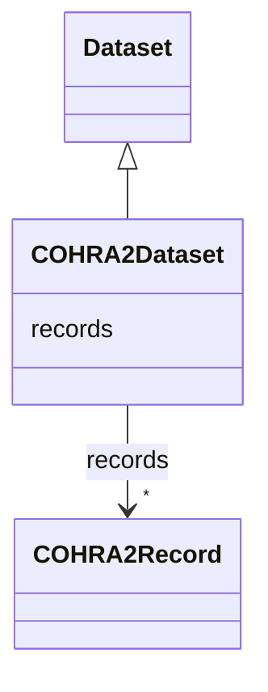

# Class: COHRA2Dataset 


_The COHRA2 dataset_


URI: [cohra2:COHRA2Dataset](https://w3id.org/OHD/DFA-study/cohra2/COHRA2Dataset)





## Inheritance
* [Dataset](Dataset.md)
    * **COHRA2Dataset**


## Slots

| Name | Cardinality and Range | Description | Inheritance |
| ---  | --- | --- | --- |
| [records](records.md) | * <br/> [COHRA2Record](COHRA2Record.md) | Slot for connecting the dataset to its records | [Dataset](Dataset.md) |


## Identifier and Mapping Information


### Schema Source


* from schema: https://w3id.org/OHD/DFA-study/cohra2


## Mappings

| Mapping Type | Mapped Value |
| ---  | ---  |
| self | cohra2:COHRA2Dataset |
| native | cohra2:COHRA2Dataset |


## LinkML Source

<!-- TODO: investigate https://stackoverflow.com/questions/37606292/how-to-create-tabbed-code-blocks-in-mkdocs-or-sphinx -->

### Direct

<details>
```yaml
name: COHRA2Dataset
description: The COHRA2 dataset
from_schema: https://w3id.org/OHD/DFA-study/cohra2
is_a: Dataset
slot_usage:
  records:
    name: records
    range: COHRA2Record

```
</details>

### Induced

<details>
```yaml
name: COHRA2Dataset
description: The COHRA2 dataset
from_schema: https://w3id.org/OHD/DFA-study/cohra2
is_a: Dataset
slot_usage:
  records:
    name: records
    range: COHRA2Record
attributes:
  records:
    name: records
    description: Slot for connecting the dataset to its records
    from_schema: https://w3id.org/OHD/DFA-study/cohra2
    rank: 1000
    alias: records
    owner: COHRA2Dataset
    domain_of:
    - Dataset
    range: COHRA2Record
    multivalued: true
    inlined_as_list: true

```
</details>