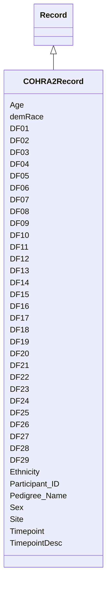

# Class: COHRA2Record 


_A record in the COHRA2 dataset_


URI: [cohra2:COHRA2Record](https://w3id.org/OHD/DFA-study/cohra2/COHRA2Record)





## Inheritance
* [Record](Record.md)
    * **COHRA2Record**


## Slots

| Name | Cardinality and Range | Description | Inheritance |
| ---  | --- | --- | --- |
| [Participant_ID](Participant_ID.md) | 0..1 <br/> [Integer](Integer.md) | The participant's study ID | direct |
| [Timepoint](Timepoint.md) | 0..1 <br/> [Integer](Integer.md) | The timepoint in the study when the visit occurred | direct |
| [TimepointDesc](TimepointDesc.md) | 0..1 <br/> [String](String.md) | Description of the timepoint | direct |
| [Site](Site.md) | 0..1 <br/> [String](String.md) | The code for the study site where the assessment was given | direct |
| [Pedigree_Name](Pedigree_Name.md) | 0..1 <br/> [Integer](Integer.md) | The Family pedigree number assigned by genetic relationship | direct |
| [Age](Age.md) | 0..1 <br/> [Float](Float.md) | The particpant's age at the time of the visit | direct |
| [Sex](Sex.md) | 0..1 <br/> [Integer](Integer.md) | The particpant's sex | direct |
| [demRace](demRace.md) | 0..1 <br/> [Integer](Integer.md) | What is your race/ethnicity? | direct |
| [Ethnicity](Ethnicity.md) | 0..1 <br/> [Integer](Integer.md) | Hispanic or Latino | direct |
| [DF01](DF01.md) | 0..1 <br/> [Integer](Integer.md) | Has fear of dental work ever caused you to put off making an appointment? | direct |
| [DF02](DF02.md) | 0..1 <br/> [Integer](Integer.md) | Has fear of dental work ever caused you to cancel or not appear for an appoin... | direct |
| [DF03](DF03.md) | 0..1 <br/> [Integer](Integer.md) | When having dental work done, my muscles become tense | direct |
| [DF04](DF04.md) | 0..1 <br/> [Integer](Integer.md) | When having dental work done, my breathing rate increases | direct |
| [DF05](DF05.md) | 0..1 <br/> [Integer](Integer.md) | When having dental work done, I perspire | direct |
| [DF06](DF06.md) | 0..1 <br/> [Integer](Integer.md) | When having dental work done, I feel nauseated and sick to my stomach | direct |
| [DF07](DF07.md) | 0..1 <br/> [Integer](Integer.md) | When having dental work done, my heart beats faster | direct |
| [DF08](DF08.md) | 0..1 <br/> [Integer](Integer.md) | Please rate how much fear, anxiety, or unpleasantness each of these dental si... | direct |
| [DF09](DF09.md) | 0..1 <br/> [Integer](Integer.md) | Please rate how much fear, anxiety, or unpleasantness each of these dental si... | direct |
| [DF10](DF10.md) | 0..1 <br/> [Integer](Integer.md) | Please rate how much fear, anxiety, or unpleasantness each of these dental si... | direct |
| [DF11](DF11.md) | 0..1 <br/> [Integer](Integer.md) | Please rate how much fear, anxiety, or unpleasantness each of these dental si... | direct |
| [DF12](DF12.md) | 0..1 <br/> [Integer](Integer.md) | Please rate how much fear, anxiety, or unpleasantness each of these dental si... | direct |
| [DF13](DF13.md) | 0..1 <br/> [Integer](Integer.md) | Please rate how much fear, anxiety, or unpleasantness each of these dental si... | direct |
| [DF14](DF14.md) | 0..1 <br/> [Integer](Integer.md) | Please rate how much fear, anxiety, or unpleasantness each of these dental si... | direct |
| [DF15](DF15.md) | 0..1 <br/> [Integer](Integer.md) | Please rate how much fear, anxiety, or unpleasantness each of these dental si... | direct |
| [DF16](DF16.md) | 0..1 <br/> [Integer](Integer.md) | Please rate how much fear, anxiety, or unpleasantness each of these dental si... | direct |
| [DF17](DF17.md) | 0..1 <br/> [Integer](Integer.md) | Please rate how much fear, anxiety, or unpleasantness each of these dental si... | direct |
| [DF18](DF18.md) | 0..1 <br/> [Integer](Integer.md) | Please rate how much fear, anxiety, or unpleasantness each of these dental si... | direct |
| [DF19](DF19.md) | 0..1 <br/> [Integer](Integer.md) | Please rate how much fear, anxiety, or unpleasantness each of these dental si... | direct |
| [DF20](DF20.md) | 0..1 <br/> [Integer](Integer.md) | Please rate how much fear, anxiety, or unpleasantness each of these dental si... | direct |
| [DF21](DF21.md) | 0..1 <br/> [Integer](Integer.md) | Choose the appropriate number for each item to rate your FEAR OF PAIN in rela... | direct |
| [DF22](DF22.md) | 0..1 <br/> [Integer](Integer.md) | Choose the appropriate number for each item to rate your FEAR OF PAIN in rela... | direct |
| [DF23](DF23.md) | 0..1 <br/> [Integer](Integer.md) | Choose the appropriate number for each item to rate your FEAR OF PAIN in rela... | direct |
| [DF24](DF24.md) | 0..1 <br/> [Integer](Integer.md) | Choose the appropriate number for each item to rate your FEAR OF PAIN in rela... | direct |
| [DF25](DF25.md) | 0..1 <br/> [Integer](Integer.md) | Choose the appropriate number for each item to rate your FEAR OF PAIN in rela... | direct |
| [DF26](DF26.md) | 0..1 <br/> [Integer](Integer.md) | Choose the appropriate number for each item to rate your FEAR OF PAIN in rela... | direct |
| [DF27](DF27.md) | 0..1 <br/> [Integer](Integer.md) | Choose the appropriate number for each item to rate your FEAR OF PAIN in rela... | direct |
| [DF28](DF28.md) | 0..1 <br/> [Integer](Integer.md) | Choose the appropriate number for each item to rate your FEAR OF PAIN in rela... | direct |
| [DF29](DF29.md) | 0..1 <br/> [Integer](Integer.md) | Choose the appropriate number for each item to rate your FEAR OF PAIN in rela... | direct |


## Usages

| used by | used in | type | used |
| ---  | --- | --- | --- |
| [COHRA2Dataset](COHRA2Dataset.md) | [records](records.md) | range | [COHRA2Record](COHRA2Record.md) |


## Identifier and Mapping Information


### Schema Source


* from schema: https://w3id.org/OHD/DFA-study/cohra2


## Mappings

| Mapping Type | Mapped Value |
| ---  | ---  |
| self | cohra2:COHRA2Record |
| native | cohra2:COHRA2Record |


## LinkML Source

<!-- TODO: investigate https://stackoverflow.com/questions/37606292/how-to-create-tabbed-code-blocks-in-mkdocs-or-sphinx -->

### Direct

<details>
```yaml
name: COHRA2Record
description: A record in the COHRA2 dataset
from_schema: https://w3id.org/OHD/DFA-study/cohra2
is_a: Record
slots:
- Participant_ID
- Timepoint
- TimepointDesc
- Site
- Pedigree_Name
- Age
- Sex
- demRace
- Ethnicity
- DF01
- DF02
- DF03
- DF04
- DF05
- DF06
- DF07
- DF08
- DF09
- DF10
- DF11
- DF12
- DF13
- DF14
- DF15
- DF16
- DF17
- DF18
- DF19
- DF20
- DF21
- DF22
- DF23
- DF24
- DF25
- DF26
- DF27
- DF28
- DF29

```
</details>

### Induced

<details>
```yaml
name: COHRA2Record
description: A record in the COHRA2 dataset
from_schema: https://w3id.org/OHD/DFA-study/cohra2
is_a: Record
attributes:
  Participant_ID:
    name: Participant_ID
    description: The participant's study ID.
    from_schema: https://w3id.org/OHD/DFA-study/cohra2
    rank: 1000
    alias: Participant_ID
    owner: COHRA2Record
    domain_of:
    - COHRA2Record
    range: integer
  Timepoint:
    name: Timepoint
    description: The timepoint in the study when the visit occurred.
    from_schema: https://w3id.org/OHD/DFA-study/cohra2
    rank: 1000
    alias: Timepoint
    owner: COHRA2Record
    domain_of:
    - COHRA2Record
    range: integer
  TimepointDesc:
    name: TimepointDesc
    description: Description of the timepoint.
    from_schema: https://w3id.org/OHD/DFA-study/cohra2
    rank: 1000
    alias: TimepointDesc
    owner: COHRA2Record
    domain_of:
    - COHRA2Record
    range: string
  Site:
    name: Site
    description: The code for the study site where the assessment was given.
    from_schema: https://w3id.org/OHD/DFA-study/cohra2
    rank: 1000
    alias: Site
    owner: COHRA2Record
    domain_of:
    - COHRA2Record
    range: string
  Pedigree_Name:
    name: Pedigree_Name
    description: The Family pedigree number assigned by genetic relationship.
    from_schema: https://w3id.org/OHD/DFA-study/cohra2
    rank: 1000
    alias: Pedigree_Name
    owner: COHRA2Record
    domain_of:
    - COHRA2Record
    range: integer
  Age:
    name: Age
    description: The particpant's age at the time of the visit.
    from_schema: https://w3id.org/OHD/DFA-study/cohra2
    rank: 1000
    alias: Age
    owner: COHRA2Record
    domain_of:
    - COHRA2Record
    range: float
  Sex:
    name: Sex
    description: The particpant's sex
    from_schema: https://w3id.org/OHD/DFA-study/cohra2
    rank: 1000
    alias: Sex
    owner: COHRA2Record
    domain_of:
    - COHRA2Record
    range: integer
  demRace:
    name: demRace
    description: What is your race/ethnicity?
    from_schema: https://w3id.org/OHD/DFA-study/cohra2
    rank: 1000
    alias: demRace
    owner: COHRA2Record
    domain_of:
    - COHRA2Record
    range: integer
  Ethnicity:
    name: Ethnicity
    description: Hispanic or Latino
    from_schema: https://w3id.org/OHD/DFA-study/cohra2
    rank: 1000
    alias: Ethnicity
    owner: COHRA2Record
    domain_of:
    - COHRA2Record
    range: integer
  DF01:
    name: DF01
    annotations:
      pun_as:
        tag: pun_as
        value: rdf:type owl:Class; rdfs:subClassOf OHD:0000421
    description: Has fear of dental work ever caused you to put off making an appointment?
    from_schema: https://w3id.org/OHD/DFA-study/cohra2
    rank: 1000
    alias: DF01
    owner: COHRA2Record
    domain_of:
    - COHRA2Record
    range: integer
  DF02:
    name: DF02
    annotations:
      pun_as:
        tag: pun_as
        value: rdf:type owl:Class; rdfs:subClassOf OHD:0000422
    description: Has fear of dental work ever caused you to cancel or not appear for
      an appointment?
    from_schema: https://w3id.org/OHD/DFA-study/cohra2
    rank: 1000
    alias: DF02
    owner: COHRA2Record
    domain_of:
    - COHRA2Record
    range: integer
  DF03:
    name: DF03
    annotations:
      pun_as:
        tag: pun_as
        value: rdf:type owl:Class; rdfs:subClassOf OHD:0000423
    description: When having dental work done, my muscles become tense.
    from_schema: https://w3id.org/OHD/DFA-study/cohra2
    rank: 1000
    alias: DF03
    owner: COHRA2Record
    domain_of:
    - COHRA2Record
    range: integer
  DF04:
    name: DF04
    annotations:
      pun_as:
        tag: pun_as
        value: rdf:type owl:Class; rdfs:subClassOf OHD:0000424
    description: When having dental work done, my breathing rate increases.
    from_schema: https://w3id.org/OHD/DFA-study/cohra2
    rank: 1000
    alias: DF04
    owner: COHRA2Record
    domain_of:
    - COHRA2Record
    range: integer
  DF05:
    name: DF05
    annotations:
      pun_as:
        tag: pun_as
        value: rdf:type owl:Class; rdfs:subClassOf OHD:0000426
    description: When having dental work done, I perspire.
    from_schema: https://w3id.org/OHD/DFA-study/cohra2
    rank: 1000
    alias: DF05
    owner: COHRA2Record
    domain_of:
    - COHRA2Record
    range: integer
  DF06:
    name: DF06
    annotations:
      pun_as:
        tag: pun_as
        value: rdf:type owl:Class; rdfs:subClassOf OHD:0000427
    description: When having dental work done, I feel nauseated and sick to my stomach.
    from_schema: https://w3id.org/OHD/DFA-study/cohra2
    rank: 1000
    alias: DF06
    owner: COHRA2Record
    domain_of:
    - COHRA2Record
    range: integer
  DF07:
    name: DF07
    annotations:
      pun_as:
        tag: pun_as
        value: rdf:type owl:Class; rdfs:subClassOf OHD:0000428
    description: When having dental work done, my heart beats faster.
    from_schema: https://w3id.org/OHD/DFA-study/cohra2
    rank: 1000
    alias: DF07
    owner: COHRA2Record
    domain_of:
    - COHRA2Record
    range: integer
  DF08:
    name: DF08
    annotations:
      pun_as:
        tag: pun_as
        value: rdf:type owl:Class; rdfs:subClassOf OHD:0000429
    description: 'Please rate how much fear, anxiety, or unpleasantness each of these
      dental situations causes you: Making an appointment for dentistry.'
    from_schema: https://w3id.org/OHD/DFA-study/cohra2
    rank: 1000
    alias: DF08
    owner: COHRA2Record
    domain_of:
    - COHRA2Record
    range: integer
  DF09:
    name: DF09
    annotations:
      pun_as:
        tag: pun_as
        value: rdf:type owl:Class; rdfs:subClassOf OHD:0000430
    description: 'Please rate how much fear, anxiety, or unpleasantness each of these
      dental situations causes you: Approching the dentist''s office.'
    from_schema: https://w3id.org/OHD/DFA-study/cohra2
    rank: 1000
    alias: DF09
    owner: COHRA2Record
    domain_of:
    - COHRA2Record
    range: integer
  DF10:
    name: DF10
    annotations:
      pun_as:
        tag: pun_as
        value: rdf:type owl:Class; rdfs:subClassOf OHD:0000431
    description: 'Please rate how much fear, anxiety, or unpleasantness each of these
      dental situations causes you: Sitting in the waiting room.'
    from_schema: https://w3id.org/OHD/DFA-study/cohra2
    rank: 1000
    alias: DF10
    owner: COHRA2Record
    domain_of:
    - COHRA2Record
    range: integer
  DF11:
    name: DF11
    annotations:
      pun_as:
        tag: pun_as
        value: rdf:type owl:Class; rdfs:subClassOf OHD:0000432
    description: 'Please rate how much fear, anxiety, or unpleasantness each of these
      dental situations causes you: Being seated in the dental chair.'
    from_schema: https://w3id.org/OHD/DFA-study/cohra2
    rank: 1000
    alias: DF11
    owner: COHRA2Record
    domain_of:
    - COHRA2Record
    range: integer
  DF12:
    name: DF12
    annotations:
      pun_as:
        tag: pun_as
        value: rdf:type owl:Class; rdfs:subClassOf OHD:0000433
    description: 'Please rate how much fear, anxiety, or unpleasantness each of these
      dental situations causes you: The smell of the dentist''s office.'
    from_schema: https://w3id.org/OHD/DFA-study/cohra2
    rank: 1000
    alias: DF12
    owner: COHRA2Record
    domain_of:
    - COHRA2Record
    range: integer
  DF13:
    name: DF13
    annotations:
      pun_as:
        tag: pun_as
        value: rdf:type owl:Class; rdfs:subClassOf OHD:0000434
    description: 'Please rate how much fear, anxiety, or unpleasantness each of these
      dental situations causes you: Seeing the dentist walk in.'
    from_schema: https://w3id.org/OHD/DFA-study/cohra2
    rank: 1000
    alias: DF13
    owner: COHRA2Record
    domain_of:
    - COHRA2Record
    range: integer
  DF14:
    name: DF14
    annotations:
      pun_as:
        tag: pun_as
        value: rdf:type owl:Class; rdfs:subClassOf OHD:0000435
    description: 'Please rate how much fear, anxiety, or unpleasantness each of these
      dental situations causes you: Seeing the anesthetic needle.'
    from_schema: https://w3id.org/OHD/DFA-study/cohra2
    rank: 1000
    alias: DF14
    owner: COHRA2Record
    domain_of:
    - COHRA2Record
    range: integer
  DF15:
    name: DF15
    annotations:
      pun_as:
        tag: pun_as
        value: rdf:type owl:Class; rdfs:subClassOf OHD:0000436
    description: 'Please rate how much fear, anxiety, or unpleasantness each of these
      dental situations causes you: Feeling the needle injected.'
    from_schema: https://w3id.org/OHD/DFA-study/cohra2
    rank: 1000
    alias: DF15
    owner: COHRA2Record
    domain_of:
    - COHRA2Record
    range: integer
  DF16:
    name: DF16
    annotations:
      pun_as:
        tag: pun_as
        value: rdf:type owl:Class; rdfs:subClassOf OHD:0000437
    description: 'Please rate how much fear, anxiety, or unpleasantness each of these
      dental situations causes you: Seeing the drill.'
    from_schema: https://w3id.org/OHD/DFA-study/cohra2
    rank: 1000
    alias: DF16
    owner: COHRA2Record
    domain_of:
    - COHRA2Record
    range: integer
  DF17:
    name: DF17
    annotations:
      pun_as:
        tag: pun_as
        value: rdf:type owl:Class; rdfs:subClassOf OHD:0000438
    description: 'Please rate how much fear, anxiety, or unpleasantness each of these
      dental situations causes you: Hearing the drill.'
    from_schema: https://w3id.org/OHD/DFA-study/cohra2
    rank: 1000
    alias: DF17
    owner: COHRA2Record
    domain_of:
    - COHRA2Record
    range: integer
  DF18:
    name: DF18
    annotations:
      pun_as:
        tag: pun_as
        value: rdf:type owl:Class; rdfs:subClassOf OHD:0000439
    description: 'Please rate how much fear, anxiety, or unpleasantness each of these
      dental situations causes you: Feeling the vibrations of the drill.'
    from_schema: https://w3id.org/OHD/DFA-study/cohra2
    rank: 1000
    alias: DF18
    owner: COHRA2Record
    domain_of:
    - COHRA2Record
    range: integer
  DF19:
    name: DF19
    annotations:
      pun_as:
        tag: pun_as
        value: rdf:type owl:Class; rdfs:subClassOf OHD:0000440
    description: 'Please rate how much fear, anxiety, or unpleasantness each of these
      dental situations causes you: Having your teeth cleaned.'
    from_schema: https://w3id.org/OHD/DFA-study/cohra2
    rank: 1000
    alias: DF19
    owner: COHRA2Record
    domain_of:
    - COHRA2Record
    range: integer
  DF20:
    name: DF20
    annotations:
      pun_as:
        tag: pun_as
        value: rdf:type owl:Class; rdfs:subClassOf OHD:0000441
    description: 'Please rate how much fear, anxiety, or unpleasantness each of these
      dental situations causes you: All things considered, how fearful are you of
      having dental work done?'
    from_schema: https://w3id.org/OHD/DFA-study/cohra2
    rank: 1000
    alias: DF20
    owner: COHRA2Record
    domain_of:
    - COHRA2Record
    range: integer
  DF21:
    name: DF21
    description: 'Choose the appropriate number for each item to rate your FEAR OF
      PAIN in relation to each event: Breaking your arm.'
    from_schema: https://w3id.org/OHD/DFA-study/cohra2
    rank: 1000
    alias: DF21
    owner: COHRA2Record
    domain_of:
    - COHRA2Record
    range: integer
  DF22:
    name: DF22
    description: 'Choose the appropriate number for each item to rate your FEAR OF
      PAIN in relation to each event: Having a foot doctor remove a wart from your
      foot with a sharp instrument.'
    from_schema: https://w3id.org/OHD/DFA-study/cohra2
    rank: 1000
    alias: DF22
    owner: COHRA2Record
    domain_of:
    - COHRA2Record
    range: integer
  DF23:
    name: DF23
    description: 'Choose the appropriate number for each item to rate your FEAR OF
      PAIN in relation to each event: Getting a paper cut on your finger.'
    from_schema: https://w3id.org/OHD/DFA-study/cohra2
    rank: 1000
    alias: DF23
    owner: COHRA2Record
    domain_of:
    - COHRA2Record
    range: integer
  DF24:
    name: DF24
    description: 'Choose the appropriate number for each item to rate your FEAR OF
      PAIN in relation to each event: Receiving an injection in your mouth.'
    from_schema: https://w3id.org/OHD/DFA-study/cohra2
    rank: 1000
    alias: DF24
    owner: COHRA2Record
    domain_of:
    - COHRA2Record
    range: integer
  DF25:
    name: DF25
    description: 'Choose the appropriate number for each item to rate your FEAR OF
      PAIN in relation to each event: Getting strong soap in both your eyes while
      bathing or showering.'
    from_schema: https://w3id.org/OHD/DFA-study/cohra2
    rank: 1000
    alias: DF25
    owner: COHRA2Record
    domain_of:
    - COHRA2Record
    range: integer
  DF26:
    name: DF26
    description: 'Choose the appropriate number for each item to rate your FEAR OF
      PAIN in relation to each event: Having someone slam a heavy car door on your
      hand.'
    from_schema: https://w3id.org/OHD/DFA-study/cohra2
    rank: 1000
    alias: DF26
    owner: COHRA2Record
    domain_of:
    - COHRA2Record
    range: integer
  DF27:
    name: DF27
    description: 'Choose the appropriate number for each item to rate your FEAR OF
      PAIN in relation to each event: Gulping a hot drink before it has cooled.'
    from_schema: https://w3id.org/OHD/DFA-study/cohra2
    rank: 1000
    alias: DF27
    owner: COHRA2Record
    domain_of:
    - COHRA2Record
    range: integer
  DF28:
    name: DF28
    description: 'Choose the appropriate number for each item to rate your FEAR OF
      PAIN in relation to each event: Receiving an injection in your hip/buttocks.'
    from_schema: https://w3id.org/OHD/DFA-study/cohra2
    rank: 1000
    alias: DF28
    owner: COHRA2Record
    domain_of:
    - COHRA2Record
    range: integer
  DF29:
    name: DF29
    description: 'Choose the appropriate number for each item to rate your FEAR OF
      PAIN in relation to each event: Falling down a flight of concrete stairs.'
    from_schema: https://w3id.org/OHD/DFA-study/cohra2
    rank: 1000
    alias: DF29
    owner: COHRA2Record
    domain_of:
    - COHRA2Record
    range: integer

```
</details>