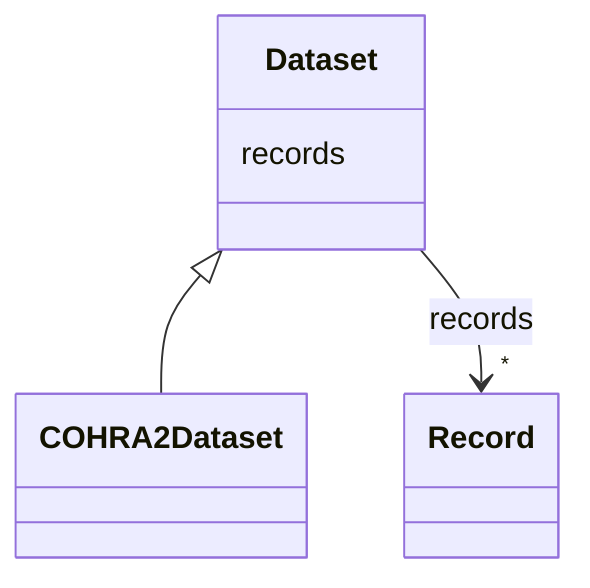

# Class: Dataset 


_The dataset for the study_


URI: [cohra2:Dataset](https://w3id.org/OHD/DFA-study/cohra2/Dataset)





## Inheritance
* **Dataset**
    * [COHRA2Dataset](COHRA2Dataset.md)


## Slots

| Name | Cardinality and Range | Description | Inheritance |
| ---  | --- | --- | --- |
| [records](records.md) | * <br/> [Record](Record.md) | Slot for connecting the dataset to its records | direct |


## Identifier and Mapping Information


### Schema Source


* from schema: https://w3id.org/OHD/DFA-study/cohra2


## Mappings

| Mapping Type | Mapped Value |
| ---  | ---  |
| self | cohra2:Dataset |
| native | cohra2:Dataset |


## LinkML Source

<!-- TODO: investigate https://stackoverflow.com/questions/37606292/how-to-create-tabbed-code-blocks-in-mkdocs-or-sphinx -->

### Direct

<details>
```yaml
name: Dataset
description: The dataset for the study
from_schema: https://w3id.org/OHD/DFA-study/cohra2
slots:
- records
tree_root: true

```
</details>

### Induced

<details>
```yaml
name: Dataset
description: The dataset for the study
from_schema: https://w3id.org/OHD/DFA-study/cohra2
attributes:
  records:
    name: records
    description: Slot for connecting the dataset to its records
    from_schema: https://w3id.org/OHD/DFA-study/cohra2
    rank: 1000
    alias: records
    owner: Dataset
    domain_of:
    - Dataset
    range: Record
    multivalued: true
    inlined: true
    inlined_as_list: true
tree_root: true

```
</details>