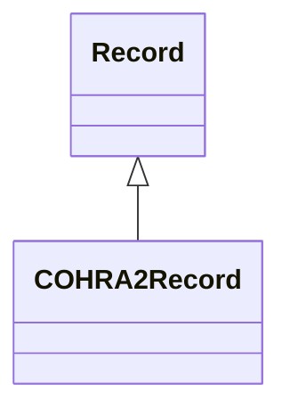

# Class: Record 


_A record in the dataset_


URI: [cohra2:Record](https://w3id.org/OHD/DFA-study/cohra2/Record)





## Inheritance
* **Record**
    * [COHRA2Record](COHRA2Record.md)


## Slots

| Name | Cardinality and Range | Description | Inheritance |
| ---  | --- | --- | --- |


## Usages

| used by | used in | type | used |
| ---  | --- | --- | --- |
| [Dataset](Dataset.md) | [records](records.md) | range | [Record](Record.md) |


## Identifier and Mapping Information


### Schema Source


* from schema: https://w3id.org/OHD/DFA-study/cohra2


## Mappings

| Mapping Type | Mapped Value |
| ---  | ---  |
| self | cohra2:Record |
| native | cohra2:Record |


## LinkML Source

<!-- TODO: investigate https://stackoverflow.com/questions/37606292/how-to-create-tabbed-code-blocks-in-mkdocs-or-sphinx -->

### Direct

<details>
```yaml
name: Record
description: A record in the dataset
from_schema: https://w3id.org/OHD/DFA-study/cohra2

```
</details>

### Induced

<details>
```yaml
name: Record
description: A record in the dataset
from_schema: https://w3id.org/OHD/DFA-study/cohra2

```
</details>